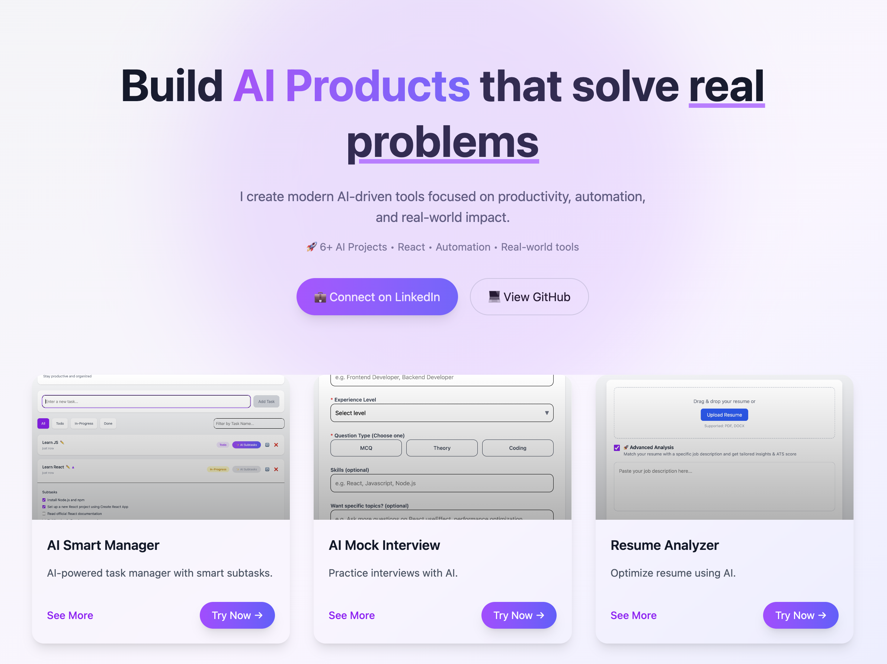

# Abhishek Saxena — AI Product Portfolio

<div>
  <div>
    
    
    
  </div>

  <h1 style="margin-top:14px;">
    Build <span style="color:#7c3aed;">AI Products</span> that solve <span style="text-decoration:underline;text-decoration-color:#a78bfa;">real problems</span>
  </h1>

  <p style="max-width:720px;">
    A clean, interactive portfolio that showcases AI projects built for productivity, automation, and practical outcomes.
    Explore each project card to see the full description and open the live demo.
  </p>
</div>



---

## 🌐 **Portfolio Link:** https://ai-products-portfolio.vercel.app/

---

## Featured Projects

| Project            | What it does                                                    | Live demo                                           |
| ------------------ | --------------------------------------------------------------- | --------------------------------------------------- |
| AI Smart Manager   | AI-powered task manager with smart subtasks.                    | https://ai-smart-manager.vercel.app/                |
| AI Mock Interview  | Practice interviews with AI-generated questions + feedback.     | https://ai-mock-interviewer-omega-ruddy.vercel.app/ |
| Resume Analyzer    | Optimize resumes against job descriptions (ATS insights).       | https://ai-resume-analyzer-indol-one.vercel.app/    |
| AI WriteWise       | Generate professional content with tone + clarity improvements. | https://ai-writewise.vercel.app/                    |
| AI Summarizer      | Summarize long content while preserving context.                | https://ai-summarizer-silk-nine.vercel.app/         |
| AI Stock Assistant | AI-driven stock trend insights and interpretation.              | https://ai-stock-assistant-sigma.vercel.app/        |

## Why this portfolio works

- Modern, gradient + “glass” UI (great first impression)
- Interactive project grid (expand/collapse details per project)
- Simple content model (projects are defined once and rendered consistently)

## Local Setup

1. Install dependencies
   ```sh
   npm install
   ```
2. Run the dev server
   ```sh
   npm run dev
   ```
3. Open the app at the URL Vite prints in your terminal.

## Build & Preview

```sh
npm run build
npm run preview
```

## Tech Stack

- React (UI)
- Vite (build/dev)

---

💡 Built with passion for AI + real-world problem solving  
📬 Open for freelance & collaboration

## License

All rights reserved.
